# Starter Kit Terraform

## Overview

This repo aims to help user to start with terraform on azure by providing studends a small project ecosystem and a case study to implement.

## Case Studies

The current case studies aims to deploy a windows datacenter 2019.

The architecture we aim to build is the following:

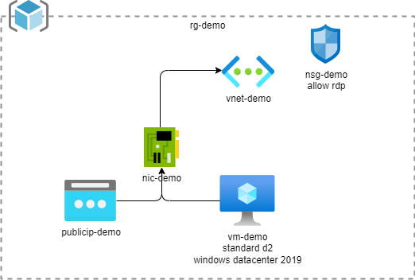

## Pre-requisites

In order to be efficient right away and make sure you have the right tooling, we based our starter kit on a **devcontainer**
running all the good stuff!
Therefore PLEASE use it!😎

## Quick start

### Prepare your remote backend

In order to work with Terraform you need to set up a [remote backend on azure](https://developer.hashicorp.com/terraform/language/settings/backends/azurerm). This remote backend will store the terraform state of your project, that way you will be able to share it with other developper and a CI/CD process. Doing this will prepare yourself to have a real production ready developpement process.

#### Login on azure portal

Please navigate to the following url [https://portal.azure.com](https://portal.azure.com) and navigate to your subcription.

You must see your subscription name like shown on the following picture

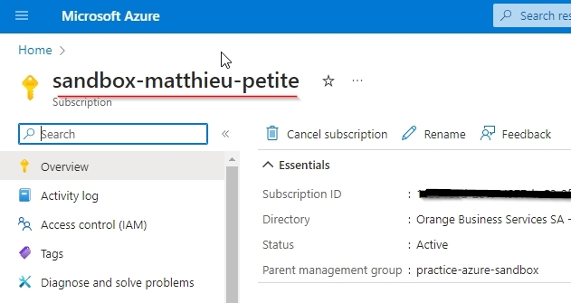

#### Create a resources group for your launchpad resources

On the left menu click on the resource groups entry and then on the create option

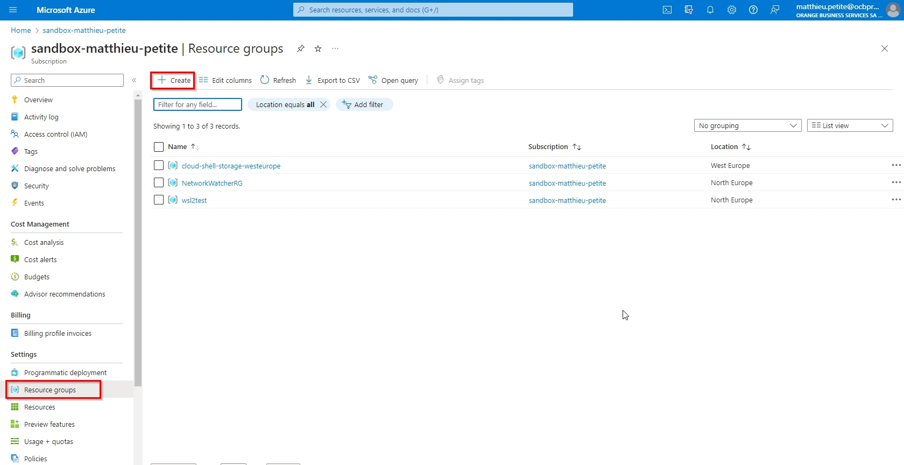

The resource group wizard is now displayed

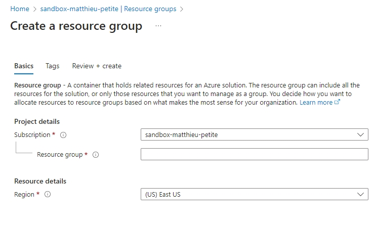

Set a name for your brand new resource group and fill the location with the nearest location of your team. Then click on the "Review & Create" button.

After few seconds, you will see in your subscription a new resource group.

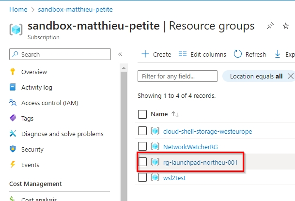

#### Create your storage account

Click on your resouce group name to enter in it. Then, click on the Create button to create a new storage account.

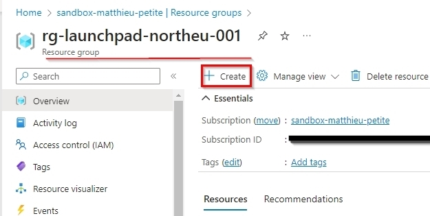

The azure market place is now open. Please lookup for a "storage account" and then create on the button "create" above the storage account product.

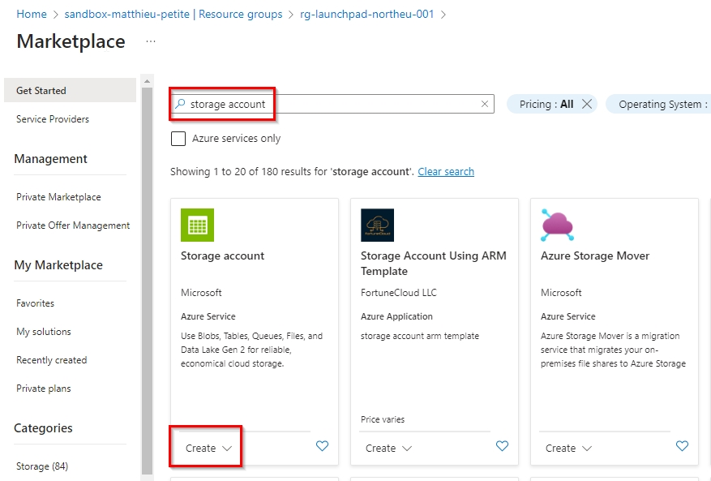

This action will launch the storage account creation wizard. Fill it with the necessary informantion.

1. On the first tab fill the forms like this. Ensure you have a unique name.
  
    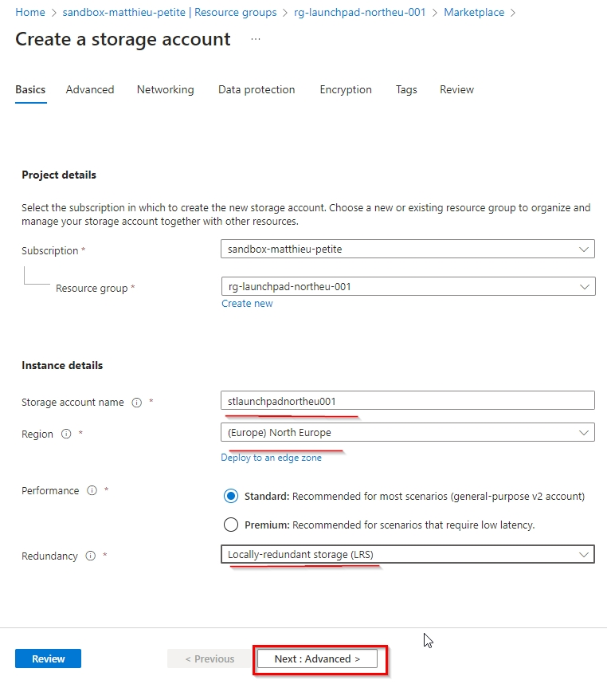

2. leave all other option as default and click on the create button at the end of the wizard.

Leave the creation process go until the end and then navigate to your resource group to check that the new storage account is well created.

  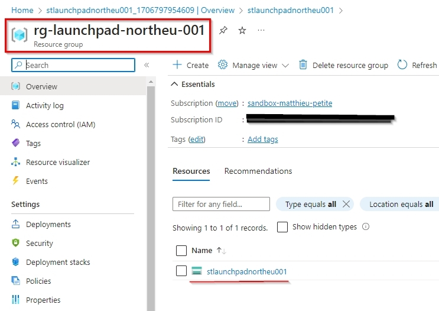

#### Create a blob container inside your storage account

In order to store the terraform state file used in our project we must create a blob storage inside our new storage account.

1. Click on your storage account to display it's configuration pane.

2. Click on the blob service

    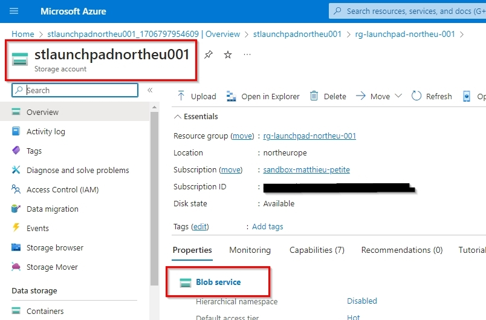

3. Click on the container button, give a name (such as tfstate) and set the access to private.

The result should be like shown bellow:

  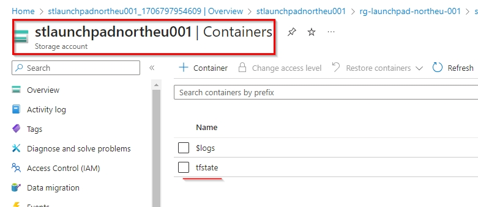

Your launchpad is now ready to recieve your tfstate file.

### Prepare your developpment environment

- Open the repository using the devcontainer in Visual Studio Code

- Run the following command to get the source code and install the necessary node modules after having forked the repository.

  ```bash
  npm install
  ```

- Login to Azure

  ```bash
  az login
  az account set --suscription <subscription ID> # if you have several subscriptions in your tenant
  ```

- Create you git branch

  ```bash
  git checkout -b <branch>
  ```

### Code your infrastructure

#### Configure Terraform providers and the remote backend, test a first plan, apply proccess

1. Create a provider.tf file, remplace the empty string with your subscription ID.

   ```terraform
   terraform {
     required_providers {
       azurerm = {
         source  = "hashicorp/azurerm"
         version = "=3.83.0"
       }
       azurecaf = {
         source  = "aztfmod/azurecaf"
         version = "=1.2.26"
       }
     }
 
     backend "azurerm" {}
   }
 
   provider "azurerm" {
     subscription_id = ""
     features {}
   }
 
   provider "azurecaf" {
   }
   ```

2. Configure your backend

   Add a backend.tfvars file in the infra folder with the configuration of your azure container. Replace the resource group name, with the one created earlier and proceed the same way for the storage account name.

    ```json
    resource_group_name  = "demo"
    storage_account_name = "abcd1234"
    container_name       = "tfstate"
    key                  = "dev.terraform.tfstate"
    ```

3. Create a main.tf file

   ```terraform
     /**
   * # Main title
   *
   * Everything in this comment block will get extracted.
   *
   * You can put simple text or complete Markdown content
   * here. Subsequently if you want to render AsciiDoc format
   * you can put AsciiDoc compatible content in this comment
   * block.
   * Start implementing your terraform code here 😎
   */
 
   locals {
     tags = {
       "env"  = "training"
       "team" = "petroineos"
       "date" = var.localdate
     }
   }
 
   resource "azurerm_resource_group" "rg" {
     name     = "rg-test"
     location = var.location
     tags     = local.tags
   }
   ```

4. Launch the "Plan command"

    In your terminal, launch the following command.

    ```bash
    npm run terraform:plan
    ```

    This command will generate a plan.out file that will store all the information that need to be done on the infrastructure

5. Launch the "Apply command"

    In your terminal, launch the following command.

    ```bash
    npm run terraform:apply
    ```

    This command will apply the change located in the plan.out file and effectively create the resources on azure.

#### Complete your code to create the whole landing zone

1. Amend your main.tf file calculate the resource group name with the azure_caf provider

    ```terraform
    /**
    * # Main title
    *
    * Everything in this comment block will get extracted.
    *
    * You can put simple text or complete Markdown content
    * here. Subsequently if you want to render AsciiDoc format
    * you can put AsciiDoc compatible content in this comment
    * block.
    * Start implementing your terraform code here 😎
    */
  
    locals {
      tags = {
        "env"  = "training"
        "team" = "petroineos"
        "date" = var.localdate
      }
    }
  
    resource "azurerm_resource_group" "rg" {
      name     = azurecaf_name.rg.result
      location = var.location
      tags     = local.tags
    }
    ```

2. Create an naming.tf file

    ```
    # cf . https://registry.terraform.io/providers/aztfmod/azurecaf/latest/docs/resources/azurecaf_name
    resource "azurecaf_name" "rg" {
      name          = var.resource_name
      resource_type = "azurerm_resource_group"
      suffixes      = [var.location_abbreviation, "001"]
      clean_input   = true
    }
  
    # cf . https://registry.terraform.io/providers/aztfmod/azurecaf/latest/docs/resources/azurecaf_name
    resource "azurecaf_name" "vnet" {
      name          = var.resource_name
      resource_type = "azurerm_virtual_network"
      suffixes      = [var.location_abbreviation, "001"]
      clean_input   = true
    }
  
    # cf . https://registry.terraform.io/providers/aztfmod/azurecaf/latest/docs/resources/azurecaf_name
    resource "azurecaf_name" "subnet" {
      name          = var.resource_name
      resource_type = "azurerm_subnet"
      suffixes      = [var.location_abbreviation, "001"]
      clean_input   = true
    }
  
    # cf . https://registry.terraform.io/providers/aztfmod/azurecaf/latest/docs/resources/azurecaf_name
    resource "azurecaf_name" "vm" {
      name          = var.resource_name
      resource_type = "azurerm_windows_virtual_machine"
      suffixes      = [var.location_abbreviation, "001"]
      clean_input   = true
    }
  
    # cf . https://registry.terraform.io/providers/aztfmod/azurecaf/latest/docs/resources/azurecaf_name
    resource "azurecaf_name" "nic" {
      name          = var.resource_name
      resource_type = "azurerm_network_interface"
      suffixes      = [var.location_abbreviation, "001"]
      clean_input   = true
    }
  
    # cf . https://registry.terraform.io/providers/aztfmod/azurecaf/latest/docs/resources/azurecaf_name
    resource "azurecaf_name" "publicip" {
      name          = var.resource_name
      resource_type = "azurerm_public_ip"
      suffixes      = [var.location_abbreviation, "001"]
      clean_input   = true
    }
  
    # cf . https://registry.terraform.io/providers/aztfmod/azurecaf/latest/docs/resources/azurecaf_name
    resource "azurecaf_name" "nsg" {
      name          = var.resource_name
      resource_type = "azurerm_network_security_group"
      suffixes      = [var.location_abbreviation, "001"]
    }
    ```

3. Create a network.tf file

   ```  
   # cf . https://registry.terraform.io/providers/hashicorp/azurerm/latest/docs/resources/virtual_network
   resource "azurerm_virtual_network" "vnet" {
     name                = azurecaf_name.vnet.result
     resource_group_name = azurerm_resource_group.rg.name
     location            = var.location
     address_space       = ["192.168.0.0/24"]
     tags                = local.tags
   }
 
   # cf . https://registry.terraform.io/providers/hashicorp/azurerm/latest/docs/resources/subnet
   resource "azurerm_subnet" "subnet" {
     name                 = azurecaf_name.subnet.result
     resource_group_name  = azurerm_resource_group.rg.name
     virtual_network_name = azurerm_virtual_network.vnet.name
     address_prefixes     = ["192.168.0.0/25"]
   }
 
   # cf . https://registry.terraform.io/providers/hashicorp/azurerm/latest/docs/resources/public_ip
   resource "azurerm_public_ip" "publicip" {
     name                = azurecaf_name.publicip.result
     location            = var.location
     resource_group_name = azurerm_resource_group.rg.name
     allocation_method   = "Dynamic"
   }
 
   # cf . https://registry.terraform.io/providers/hashicorp/azurerm/latest/docs/resources/network_interface
   resource "azurerm_network_interface" "nic" {
     name                = azurecaf_name.nic.result
     location            = var.location
     resource_group_name = azurerm_resource_group.rg.name
 
     ip_configuration {
       name                          = "internal"
       subnet_id                     = azurerm_subnet.subnet.id
       public_ip_address_id          = azurerm_public_ip.publicip.id
       private_ip_address_allocation = "Dynamic"
     }
   }
   ```

4. Create a security.tf file

   ```
   # cf . https://registry.terraform.io/providers/hashicorp/azurerm/latest/docs/resources/network_security_group
   #tfsec:ignore:azure-network-no-public-ingress
   #tfsec:ignore:azure-network-disable-rdp-from-internet
   resource "azurerm_network_security_group" "nsg" {
     name                = azurecaf_name.nsg.result
     location            = var.location
     resource_group_name = azurerm_resource_group.rg.name
 
     security_rule {
       name                       = "RDP"
       priority                   = 1001
       direction                  = "Inbound"
       access                     = "Allow"
       protocol                   = "Tcp"
       source_port_range          = "*"
       destination_port_range     = "3389"
       source_address_prefix      = "*"
       destination_address_prefix = "*"
     }
   }
 
   # cf . https://registry.terraform.io/providers/hashicorp/azurerm/latest/docs/resources/subnet_network_security_group_association
   resource "azurerm_subnet_network_security_group_association" "association" {
     subnet_id                 = azurerm_subnet.subnet.id
     network_security_group_id = azurerm_network_security_group.nsg.id
   }
   ```

5. create a variable.tf file

   ```
   variable "location" {
     type        = string
     description = "Location of the resources"
     default     = "North Europe"
   }
 
   variable "location_abbreviation" {
     type        = string
     description = "Location abbreviation of the resources"
     default     = "northeu"
   }
 
   variable "localdate" {
     type        = string
     description = "Local Date"
     default     = "15122022"
   }
 
   variable "resource_name" {
     type    = string
     default = "default_resource_name"
   }
 
   variable "admin_password" {
     type      = string
     default   = "default_admin_password"
     sensitive = true
   }
 
   variable "admin_username" {
     type    = string
     default = "default_admin_username"
   }
   ```

6. create a virtualmachine.tf file

   ```
   # cf . https://registry.terraform.io/providers/hashicorp/azurerm/latest/docs/resources/windows_virtual_machine
   resource "azurerm_windows_virtual_machine" "vm" {
     name                  = azurecaf_name.vm.result
     resource_group_name   = azurerm_resource_group.rg.name
     location              = var.location
     size                  = "Standard_D2s_v3"
     admin_username        = var.admin_username
     admin_password        = var.admin_password
     network_interface_ids = [azurerm_network_interface.nic.id]
 
     os_disk {
       caching              = "ReadWrite"
       storage_account_type = "Standard_LRS"
     }
 
     source_image_reference {
       publisher = "MicrosoftWindowsServer"
       offer     = "WindowsServer"
       sku       = "2019-Datacenter"
       version   = "latest"
     }
   }
 
   ```

7. Create an ouput.tf file

   ```
   output "rg_name" {
     description = "This is the output of the resource group name"
     value       = azurerm_resource_group.rg.name
   }
 
   output "rg_location" {
     description = "This is the output of the resource group location"
     value       = azurerm_resource_group.rg.location
   }
 
   output "public_ip" {
     description = "This is the output of the public ip"
     value       = azurerm_public_ip.publicip.ip_address
   }
   ```

8. Generate your variable file and populate it

    Generate terraform.tfvars file with the following command and update variables

    ```bash
      npm run terraform:generate-tfvars
    ```

    A brand terraform.tfvars file must appear in your infra folder. Its a key value file that looks like this one:

    ```
    admin_password        = ":your very strong password"
    admin_username        = "your admin user name"
    localdate             = "15122022"
    location              = "North Europe"
    location_abbreviation = "northeu"
    resource_name         = "mpe"
    ```

    Please fill the information

9. Launch the "Plan command"

    In your terminal, launch the following command.

    ```bash
    npm run terraform:plan
    ```

    This command will generate a plan.out file that will store all the information that need to be done on the infrastructure, In our case it will destroy the resource group created in the previous plan apply operation and recreate the whole architecture.

10. Launch the "Apply command"

    In your terminal, launch the following command.

    ```bash
    npm run terraform:apply
    ```

    This command will apply the change located in the plan.out file and effectively create the resources on azure.

### Main terminal commands used while developping

#### Plan your infrastructure

- Plan your terraform deployment

  ```bash
  npm run terraform:plan
  ```

#### Apply your infrastructure

- Apply your terraform deployment

  ```bash
  npm run terraform:apply
  ```

#### Destroy your infrastructure

- Destroy your terraform deployment (for cleanup)

  ```bash
  npm run terraform:destroy
  ```

- Add and Commit your code

  ```bash
  git add .
  npm run commit
  git push
  ```

## Semantic versioning

In order to be able to build automation processes around the versioning we need consistency our git messages management.
[Commitizen](https://www.npmjs.com/package/commitizen) will help us use git in a conventinal manner.
To commit your code, you can use the following commands.

```bash
npm run commit
# or
npx cz
```
